CUDA Rasterizer
===============

**University of Pennsylvania, CIS 565: GPU Programming and Architecture, Project 4**

* Byumjin Kim
* Tested on: Windows 10, i7-6700HQ @ 2.60GHz 15.89GB (Personal labtop)

### Overview

- Model : Johanna.gltf
- Resolution : 800 x 800

* Physically-based rendering material
* Texture mapping
* Normal mapping
* Environment Map
* Bloom (HDR)

In this project, 

### Complete requirements

- Basic Features
	- Vertex shading
	- Primitive assembly
	- Rasterization
	- Fragment shading
	- A depth buffer for storing and depth testing fragments
	- Fragment-to-depth-buffer writing
	- Blinn-Phong shading

- Additional Features
	- Correct color interpolation between points on a primitive
	- Bloom with Using shared memory
	- Backface culling with using stream compaction
	- Blending Stage	
	- UV texture mapping with bilinear texture filtering and perspective correct texture coordinates	
	- Super Sample Anti-Aliasing

- Independent features
	- Physically-based BRDF shading
	- Environment mapping
	- Normal mapping

#### Correct color interpolation between points on a primitive

| Normal Vertex | Corrected Vertex | Comparision |
| ----------- | ----------- | ----------- |
| 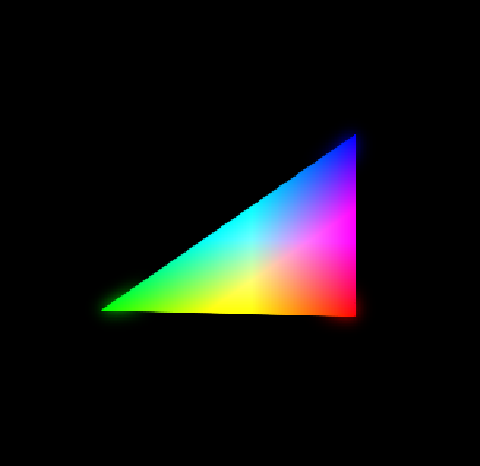 | 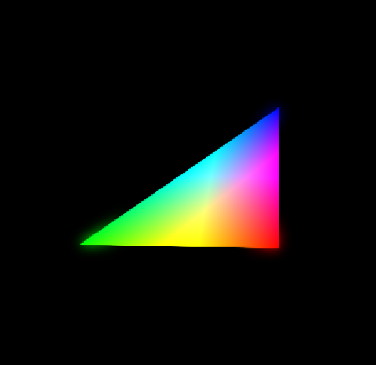 | 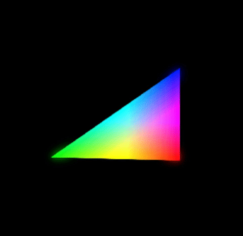 |

#### Perspective correct texture coordinates & Bilinear texture filtering

| Normal | Corrected | Bilinear | Comparision |
| ----------- | ----------- | ----------- | ----------- |
| 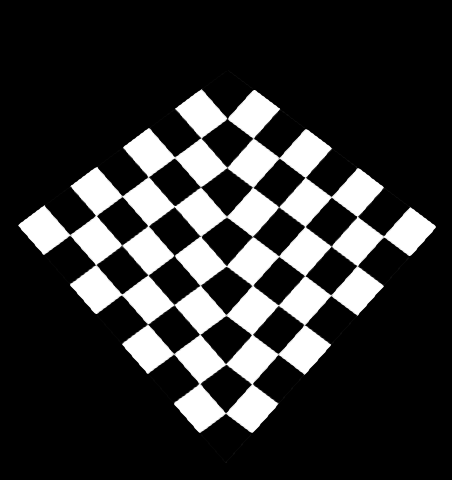 | 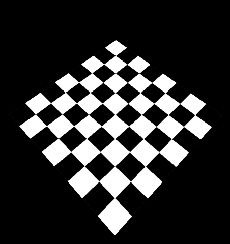 |  | 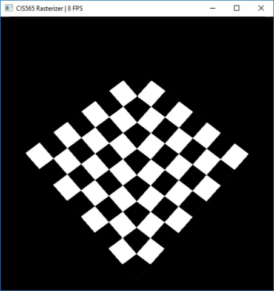 |

#### Normal(Bump) mapping

| Vertex Normal | Normal mapping | Example |
| ----------- | ----------- | ----------- |
| 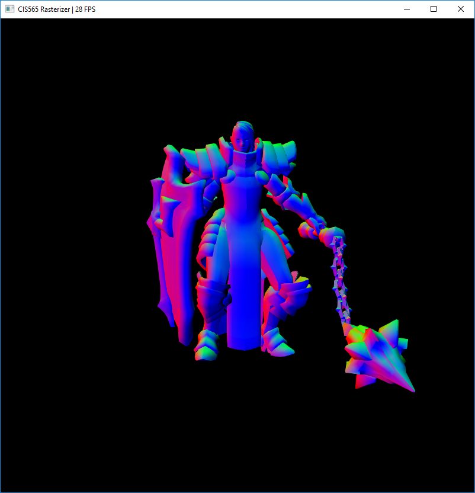 | 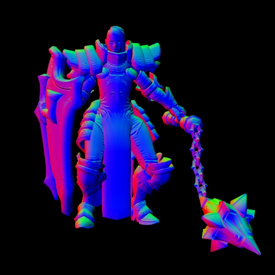 | 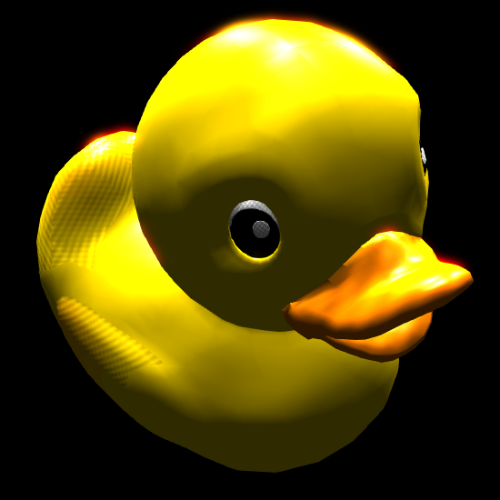 |

#### Backface culling

| Normal | Back Face Culling |
| ----------- | ----------- | 
| 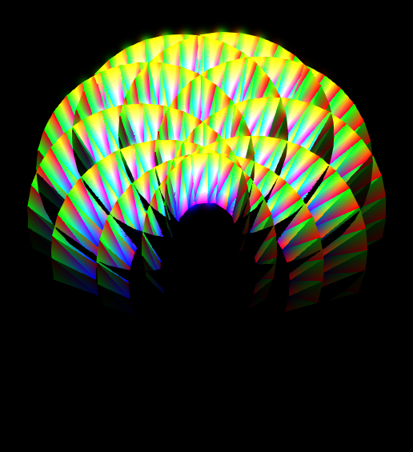 |  |

#### Super Sample Anti-Aliasing

|  x1 Sample | x16 Sample | Comparision |
| ----------- | ----------- | ----------- | 
| 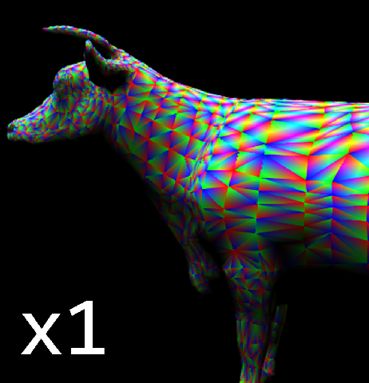 | 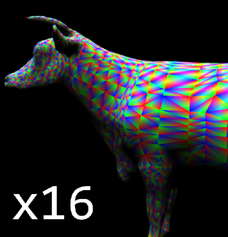 | 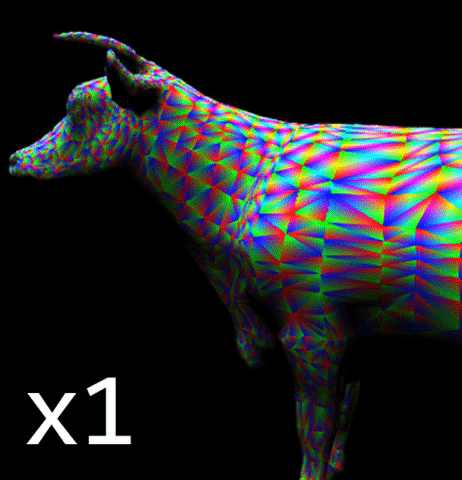 |

#### Physically-based BRDF shading

|  Diffuse |  Roughness | Metallic |
| ----------- | ----------- | ----------- | 
| 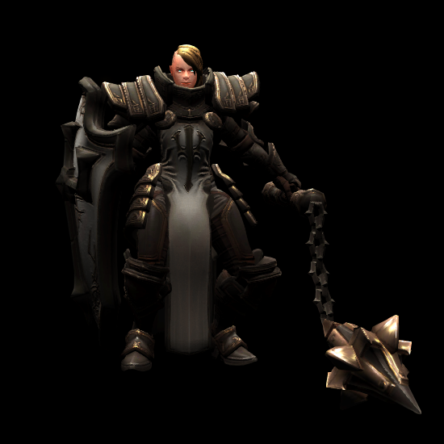 | 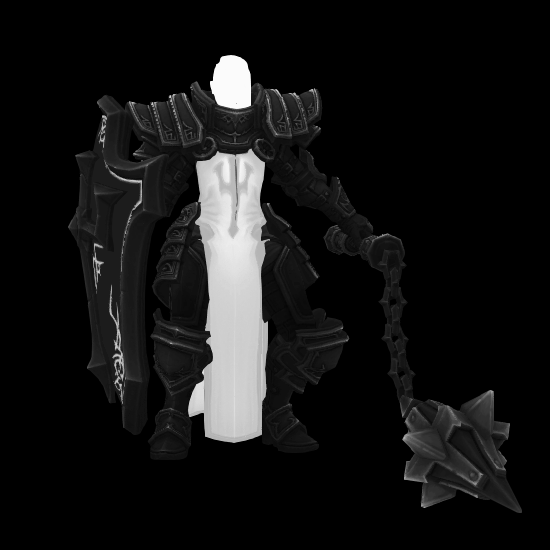 | 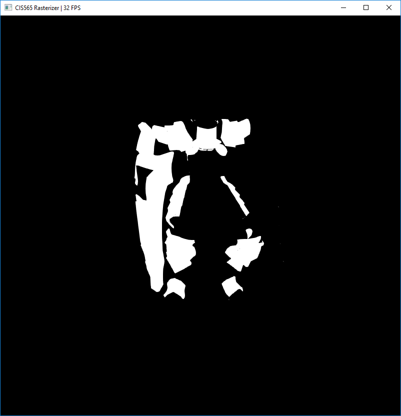  |

|  Environment |  PBS | PBS + Bloom |
| ----------- | ----------- | ----------- | 
| 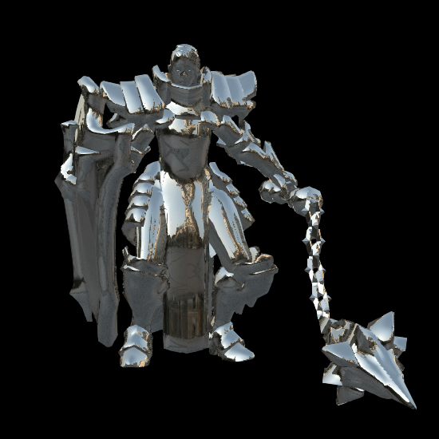 | 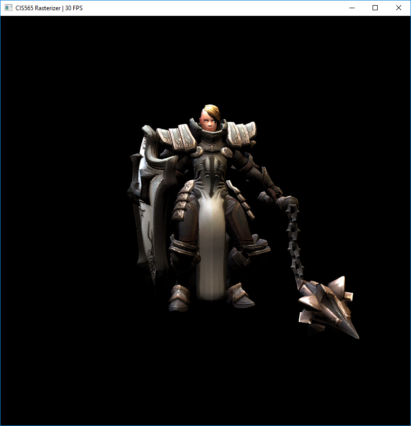 | 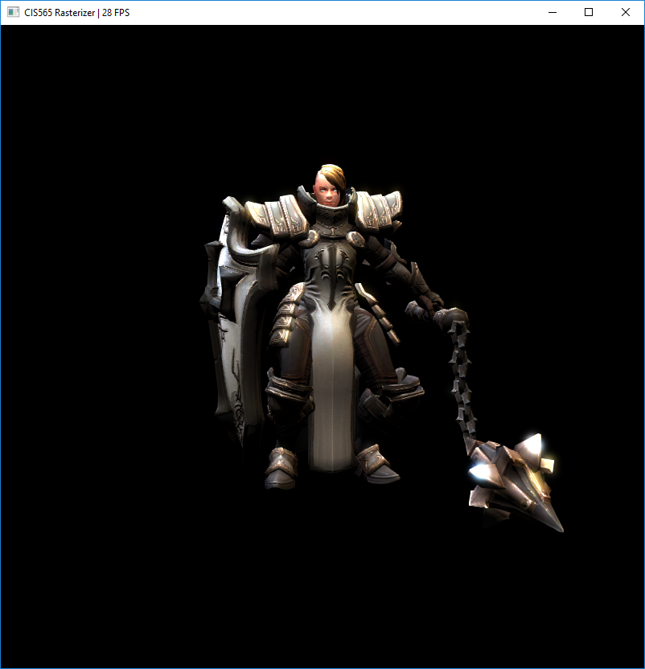  |

#### Environment mapping

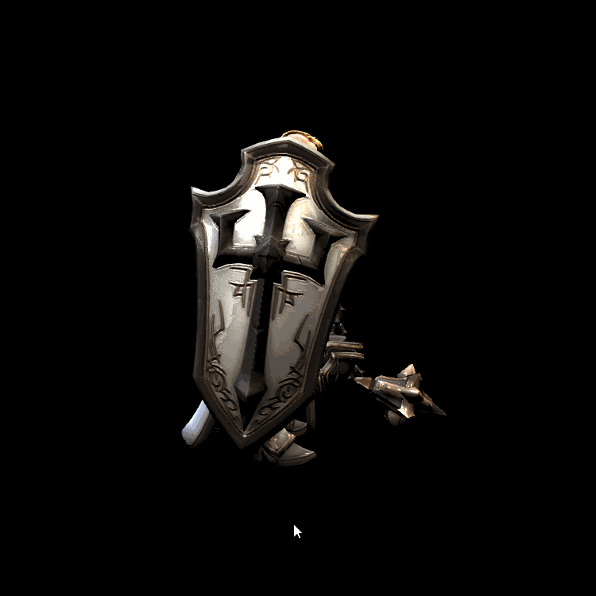

#### Bloom

|  Extract HDR Fragments | Bloom Only | PBS + Bloom |
| ----------- | ----------- | ----------- | 
| 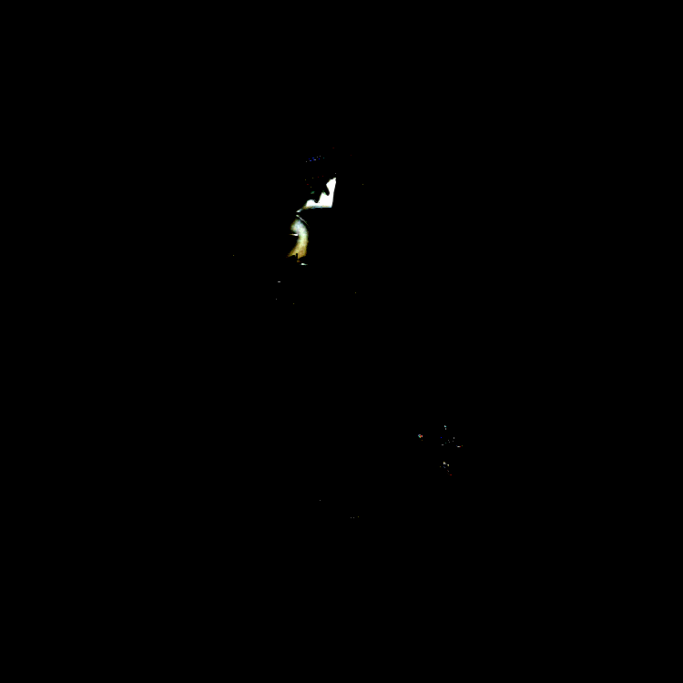 | 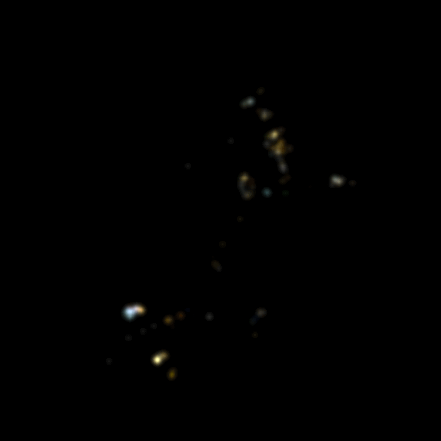 | 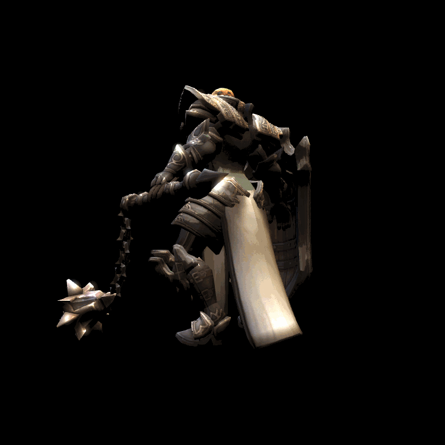 |

### Performance Analysis

#### Perspective correct texture coordinates

#### Bilinear texture filtering

#### Backface culling

#### Super Sample Anti-Aliasing

#### Blinn-Phong vs Physically-based BRDF shading

#### Environment mapping

#### Bloom